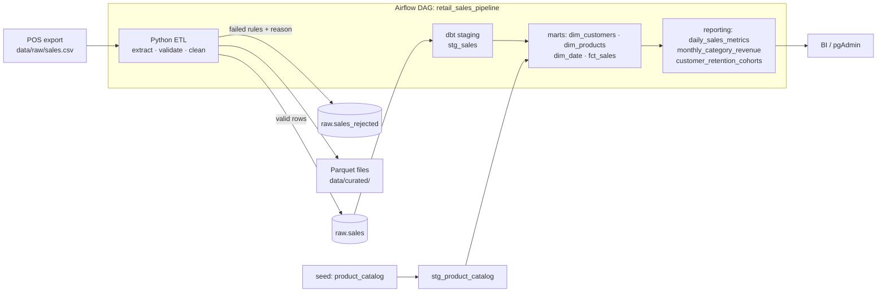

# Retail Sales Data Platform

An end-to-end batch data pipeline for a retail business. It covers ingestion, data
quality, a PostgreSQL warehouse modeled with **dbt** as a star schema, orchestration with
**Apache Airflow**, and CI that runs every layer against a real database.



## Highlights

| Area | What's implemented |
| --- | --- |
| **Ingestion** | Reads raw CSV as text, like a landing zone. A seeded generator produces ~15k realistic order lines with seasonality, repeat customers, discounts, and injected dirty records. |
| **Data quality** | Rule-based validation. Bad rows are **quarantined with a reason** (`invalid_quantity`, `duplicate_record`, …) instead of being dropped silently. The run **fails if the rejection rate is above a threshold** (default 5%). |
| **Loading** | Each table is replaced inside one transaction, so re-runs are **idempotent** and readers never see a half-loaded table. |
| **Modeling (dbt)** | Staging → star schema (`fct_sales` + 3 dimensions) → reporting marts. `fct_sales` is **incremental** with a lookback window for late-arriving data. Uses surrogate keys and a zero-filled date spine. |
| **Testing** | 23 pytest unit/integration tests plus 40+ dbt data tests (unique, not-null, referential integrity, accepted values, custom generic tests). A reconciliation test proves raw, fact and report revenue match. |
| **Orchestration** | Airflow 3 DAG: `extract_validate_load → dbt_source_freshness → dbt_build`, with retries. The pipeline runs in its own virtualenv inside the image, so it can't conflict with Airflow's packages. |
| **CI** | GitHub Actions spins up Postgres, runs lint and tests, then runs the full ETL and `dbt build` twice to cover both the full and the incremental path. |

## Project structure

```
├── src/data_engineering_project/
│   ├── generate.py      # synthetic raw data generator (deterministic seed)
│   ├── etl.py           # extract, validate/quarantine, transform, quality checks
│   ├── load.py          # idempotent, transactional load into Postgres
│   ├── pipeline.py      # orchestration entry point / CLI
│   └── config.py        # settings from environment / .env
├── dbt/
│   ├── models/staging/  # stg_sales, stg_product_catalog, sources + freshness
│   ├── models/marts/core/       # dim_customers, dim_products, dim_date, fct_sales
│   ├── models/marts/reporting/  # daily metrics, category revenue, retention cohorts
│   ├── seeds/           # product_catalog.csv (product master data)
│   ├── macros/          # surrogate_key, schema naming
│   └── tests/           # generic + singular (reconciliation) data tests
├── airflow/
│   ├── dags/retail_sales_pipeline.py
│   └── Dockerfile
├── sql/init.sql         # raw-layer DDL + Airflow metadata DB
├── tests/               # pytest suite
└── docker-compose.yml   # Postgres, pgAdmin, Airflow
```

## Warehouse model

| Schema | Model | Grain |
| --- | --- | --- |
| `raw` | `sales`, `sales_rejected` | Order line as loaded / rejected raw row |
| `staging` | `stg_sales`, `stg_product_catalog` | Typed and renamed source data (views) |
| `marts` | `fct_sales` | One row per order line (incremental) |
| `marts` | `dim_customers` | One row per customer, with lifetime value and segment (VIP / Repeat / One-time) |
| `marts` | `dim_products` | One row per product (catalog + unknown products seen in sales) |
| `marts` | `dim_date` | One row per calendar day |
| `reporting` | `daily_sales_metrics` | Day: orders, customers, units, revenue, AOV, 7-day average |
| `reporting` | `monthly_category_revenue` | Month × category: revenue, share of month, MoM growth |
| `reporting` | `customer_retention_cohorts` | Acquisition month × months since first order |
| `reporting` | `top_customers` | Top 20 customers by lifetime revenue |

## Quick start

### Option A: full stack with Docker (Postgres + pgAdmin + Airflow)

```bash
cp .env.example .env
make up
```

- Airflow UI: http://localhost:8080. Trigger the `retail_sales_pipeline` DAG.
- pgAdmin: http://localhost:5050 (admin@example.com / admin). Connect to host `postgres`.

### Option B: run locally against the Docker Postgres

```bash
cp .env.example .env
make setup        # virtualenv + dependencies (incl. dbt)
docker compose up -d postgres
make all          # ETL + load + dbt build
make dbt-docs     # browse the lineage graph at http://localhost:8081
```

### Other commands

```bash
make help         # list all targets
make data         # regenerate data/raw/sales.csv
make run          # ETL to parquet files only (no database needed)
make test         # pytest
make lint         # ruff check + format check
```

## Example queries

```sql
-- Revenue by category
select category, sum(total_revenue) as revenue
from reporting.monthly_category_revenue
group by category order by revenue desc;

-- Why were rows rejected?
select rejection_reason, count(*) from raw.sales_rejected group by 1 order by 2 desc;

-- Retention curve for the January cohort
select months_since_first_order, retention_pct
from reporting.customer_retention_cohorts
where cohort_month = '2024-01-01' order by 1;
```

## Design decisions

- **Quarantine instead of drop.** Every rejected record is kept with its original raw values
  and a reason. That makes data issues visible and fixable upstream, and the rejection-rate
  threshold stops a bad file from silently shrinking the reports.
- **Full refresh of the raw layer + incremental facts.** The source is a full daily export, so
  the raw table is replaced on each run. `fct_sales` reprocesses only the last few days
  (`fct_sales_lookback_days`, default 3), which keeps builds cheap as history grows.
- **ETL in Python, modeling in SQL.** Python handles messy parsing and validation; dbt handles
  business logic, so it stays declarative, tested and documented with lineage.
- **Isolated runtime for pipeline code in Airflow.** dbt and pandas pin dependencies that
  often clash with Airflow's own, so they run from a separate virtualenv.

## Possible extensions

- Ingest from an API or object storage (S3/MinIO) instead of a local CSV.
- Add dbt snapshots (SCD Type 2) for product price changes.
- Add a dashboard (Metabase/Superset) on top of the `reporting` schema.
- Partition `fct_sales` by month and add table-level indexes for large volumes.
